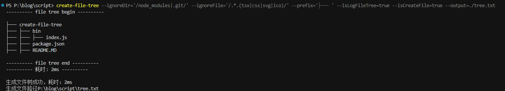

# create-file-tree

## 介绍

- 使用 `node` 生成文件树结构。

## 安装依赖

```bash
npm install @super-code-candy/create-file-tree -g
```

## 配置项

> 没有添加 `--input` 的原因是，从使用上来说，在某个目录下执行该命令的方便性比传递指定执行目录的方便性更好。

### --ignoreDir

- 需要被忽略的文件夹名称，传递正则表达式字符串，在传递该属性时，需要对值带上 `''`，例如 `--ignoreDir='/node_modules|.git/'`。
- 默认值: `undefined`，即获取到的所有文件夹都会被写入文件树。

### --ignoreFile

- 需要被忽略的文件名称，传递正则表达式字符串，在传递该属性时，需要对值带上 `''`，例如 `--ignoreFile='/.*.(tsx|css|svg|ico)/'`。
- 默认值: `undefined`，即获取到的所有文件都会被写入文件树。

### --prefix

- 生成文件树的前导字符，传递时需要带上 `''`，例如: `'├─── '`

默认值：`'├─── '`。

### --isLogFileTree

- 是否需要将生成的文件树内容输出到控制台，传递为 `true` 的时候为需要输出到控制，其他值则不进行输出。

默认值: `true`。

### --isCreateFile

> 注意：该配置的值传递为非 `true` 的时候，则会强制将生成的文件树内容生成到控制台。

- 是否需要再生成后文件树内容写入单独的文件，传递为 `true` 的时候代表需要生成单独的文件。
- 默认值: `true`。

### --output

> 传递的数据会用 `path.join(process.cwd(), output)` 进行拼接

- 将生成的文件树内容生成到指定的文件中。
- 默认值： `path.join(process.cwd(), './file-tree.txt')`。

## 使用

### 指令

```bash
create-file-tree --ignoreDir='/node_modules|.git/' --ignoreFile='/.*.(tsx|css|svg|ico)/' --prefix='├─── ' --isLogFileTree=true --isCreateFile=true --output=./tree.txt
```

### 控制台输出



### tree.text 内容

```text
├─── create-file-tree
├─── ├─── bin
├─── ├─── ├─── index.js
├─── ├─── package.json
├─── ├─── README.MD

```